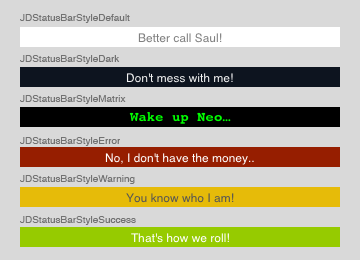

# StatusBarNotification

Show messages on top of the status bar. Customizable colors, font and animation. Supports progress display and can show an activity indicator. iOS 7/8 ready. This is the swift version of ,thanks @jaydee3. Please open a [Github issue], if you think anything is missing or wrong.

## Installation

#### CocoaPods:

not support

#### Manually:

1. Drag the `DBStatusBarNotification/DBStatusBarNotification` folder into your project.
2. Add `#include "StatusBarNotification.h"`, where you want to use it

## Usage

StatusBarNotification is a singleton. You don't need to initialize it anywhere.
Just use the following class methods:

### Showing a notification
    
    class func showWithStatus(status: String) -> UIView?
    class func showWithStatus(status: String, timeInterval: NSTimeInterval) -> UIView?

The return value will be the notification view. You can just ignore it, but if you need further customization, this is where you can access the view.

### Dismissing a notification

    class func dismiss()
    class func dismissAfter(delay: NSTimeInterval)
    
### Showing progress

    class func showProgress(progress: CGFloat)  // Range: 0.0 - 1.0
    
### Showing activity

    class func showActivityIndicator(show: Bool, style:UIActivityIndicatorViewStyle)
    
### Showing a notification with alternative styles

Included styles:

Use them with the following methods:

    class func showWithStatus(status: String, styleName: String) -> UIView?
    class func showWithStatus(status: String, timeInterval: NSTimeInterval, styleName: String) -> UIView?
                 
To present a notification using a custom style, use the `identifier` you specified in `addStyleNamed:prepare:`. See Customization below.

### Beware

[@goelv](https://github.com/goelv) / [@dskyu](https://github.com/dskyu) / [@graceydb](https://github.com/graceydb) informed me (see [#15](https://github.com/jaydee3/JDStatusBarNotification/issues/15), [#30](https://github.com/jaydee3/JDStatusBarNotification/issues/30), [#49](https://github.com/jaydee3/JDStatusBarNotification/issues/49)), that his app got rejected because of a status bar overlay (for violating 10.1/10.3). So don't overuse it. Although I haven't heard of any other cases.

## Customization

    class func setDefaultStyle(prepareBlock: PrepareStyleBlock?) 
    class func addStyleNamed(identifier: String, prepareBlock:PrepareStyleBlock) -> String {

The `prepareBlock` gives you a copy of the default style, which can be modified as you like:

    StatusBarNotification.addStyleNamed(<#identifier#>) { (style) -> StatusBarStyle in

                                                         // main properties
                                                         style!.barColor  = <#color#>
                                                         style!.textColor = <#color#>
                                                         style!.font = <#font#>

                                                         // advanced properties
	                                                     style.animationType = <#type#>;
	                                                     style.textShadow = <#shadow#>;
	                                                     style.textVerticalPositionAdjustment = <#adjustment#>;

                                                         // progress bar
                                                         style.progressBarColor = <#color#>;
                                                         style.progressBarHeight = <#height#>;
                                                         style.progressBarPosition = <#position#>;
                                                         return style!
                                                        }

#### Animation Types

- `None`
- `Move`
- `Bounce`
- `Fade`

#### Progress Bar Positions

- `Bottom`
- `Center`
- `Top`
- `Below`
- `NavBar`

[Github issue]: https://github.com/dby/StatusBarNotification/issues
